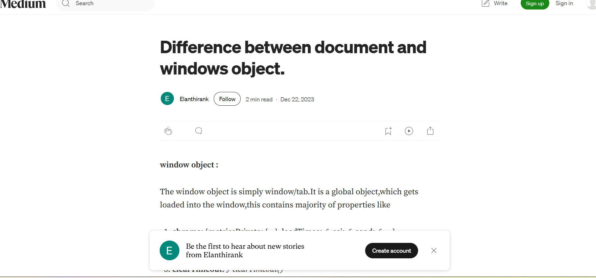

## 🌐 day-2-ass (Difference Between Window and Document Objects in JavaScript)

This project demonstrates the difference between the window object and the document object in JavaScript using a simple HTML and JS setup. It helps beginners understand how these two objects work in the browser environment.

---
## Blog

Write the blog on the Difference between document and windows object.
Find the link : link https://medium.com/@elanthirank/difference-between-window-and-document-objects-6847d008d07e

---

## ✨ Features

- 📄 Explains window object and its global properties.

- 📑 Explains document object and its role in DOM manipulation.

- 🖥️ Console logging examples for better understanding.

- 🔍 Clear difference with examples (window.open() vs document.open()).

- 🎯 Beginner-friendly explanation with sample code.

---

## 📂 Project Structure

 ├── articles/  ├── window-vs-document.md # Window vs Document objects ├── README.md

---

## 🔽 Clone the Repository
git clone https://github.com/Elanthiran/day-2-ass.git
cd day-2-ass

---
## ⚡ Usage
1. Open any .md file inside articles/ to read the blog post.

2. You can also copy the markdown content into platforms like Medium, Hashnode, or your personal site.

📸 Screenshots

---

## 🛠️ Tech Stack
- Markdown (.md) for articles

- Medium (optional) for publishing

---

## 🚧 Future Improvements

- Add interactive examples (alert, confirm, prompt).

- Add DOM manipulation demos (createElement, appendChild).

- Add visual diagrams explaining window vs document.

- Convert into a small React learning project.

---

## 🤝 Contributing

Contributions are welcome!

- Fork the repository

- Create a feature branch (git checkout -b feature-name)

- Commit changes (git commit -m 'Added new feature')

- Push to branch (git push origin feature-name)

- Open a Pull Request

---

## 📜 License

This project is licensed under the MIT License – feel free to use and modify it.
